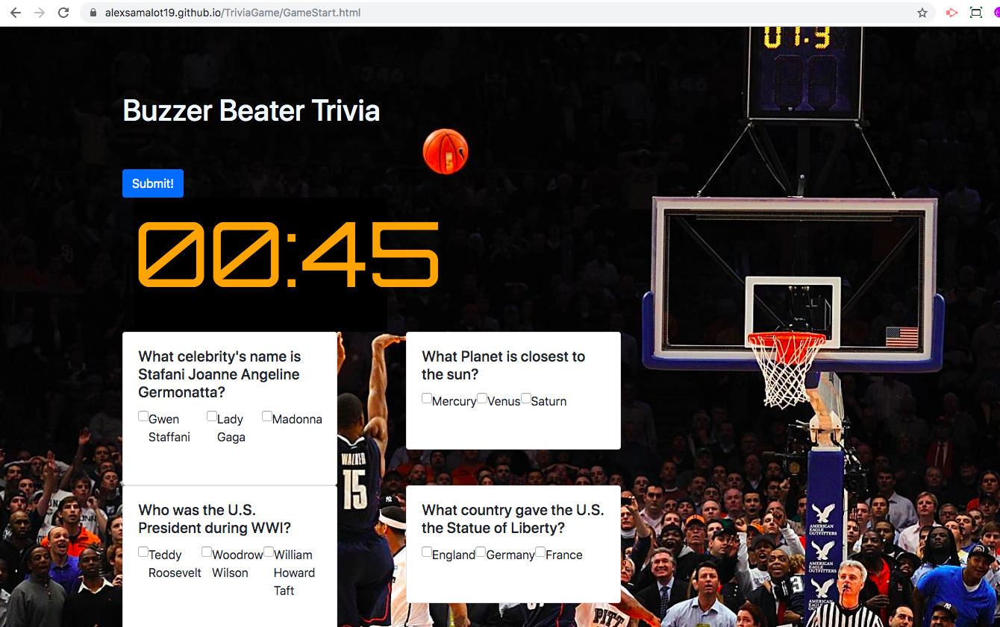

# TriviaGame

 

## Description

A trivia game with multiple choice questions and a limited amount of time to finish the quiz. The game ends when the time runs out and the score is displayed.

 

## Overview of App Organization

| Path    | Purpose          |
| -------- | -------------- |
| GameStart.html | Contains the start page and a single button to begin the game |
| index.html | Contains the interactive web elements for the trivia|
| assets/javascript/app.js | Contains setInterval method for the countdown and logic for evaluating the user's performance |
| assets/css/style.css | Contains syling elements |

 

## Run Instructions

After clicking the start button, the countdown begins! Click the checkbox next to the correct answer before the minute timer reaches zero (as shown below). Click Submit to see your score or wait until time runs out.

 

## This App Utilizes

[Bootstrap](https://getbootstrap.com/docs/4.3/getting-started/introduction/)

[JavaScript-setInterval](https://www.w3schools.com/jsref/met_win_setinterval.asp)

 

## Role in Development

My name is Alex I am a bootcamp student whose portfolio can be found
[here.]( https://alexsamalot19.github.io/Samalot-Alexander-Portfolio/)

I designed this trivia game using JavaScript for the logic and jQuery to manipulate HTML. SetInterval is used to create the countdown and bootstrap cards are used for styling the trivia questions